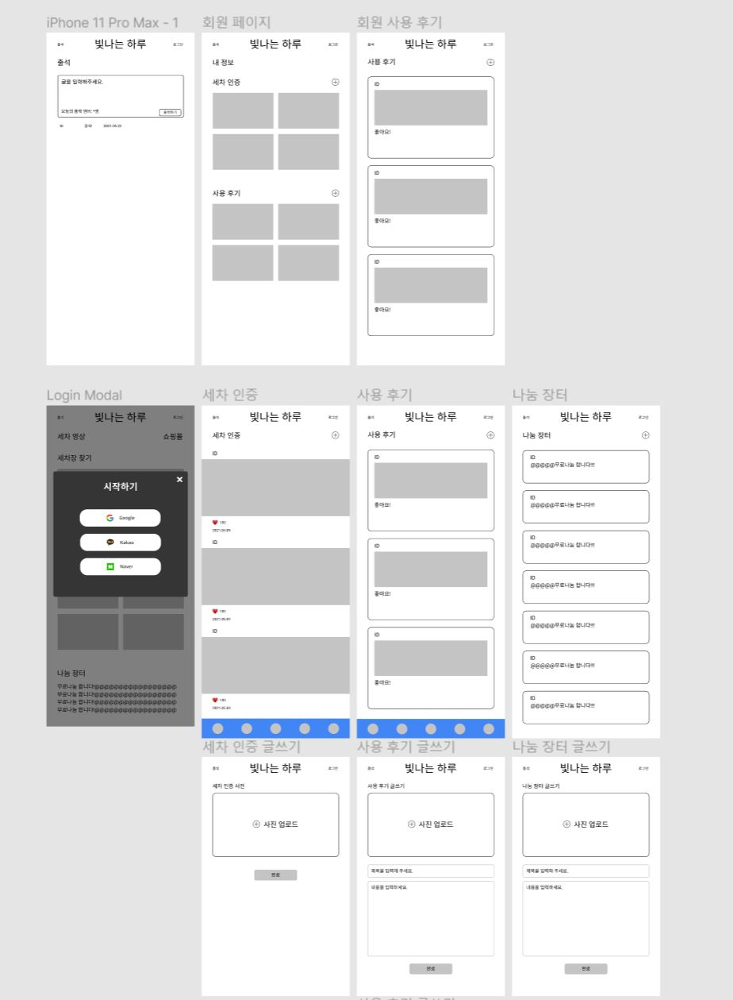
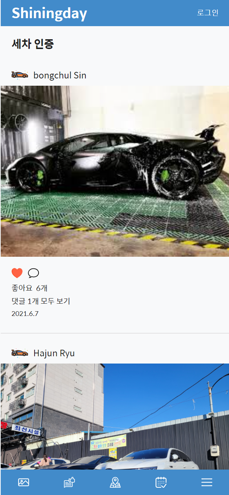
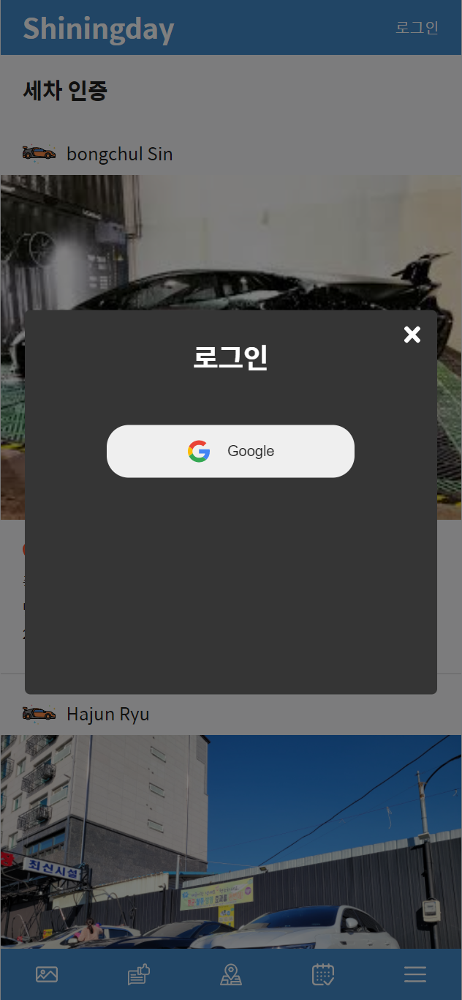
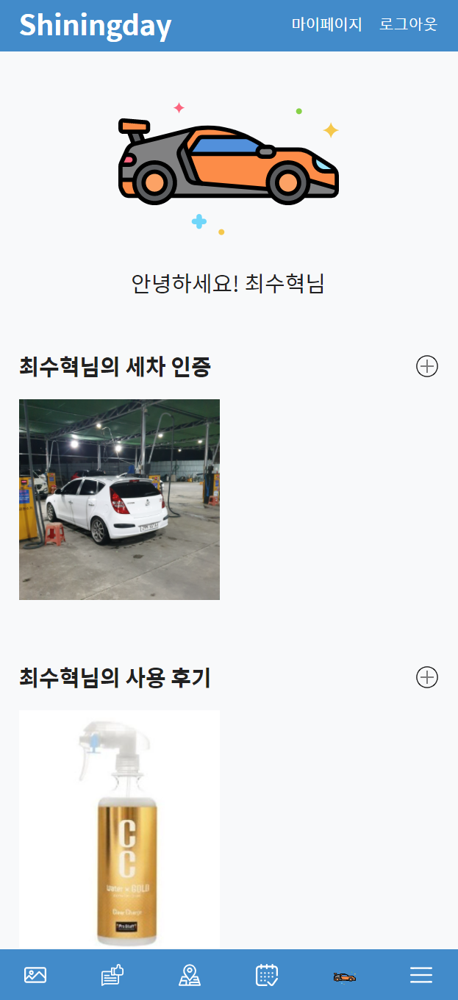
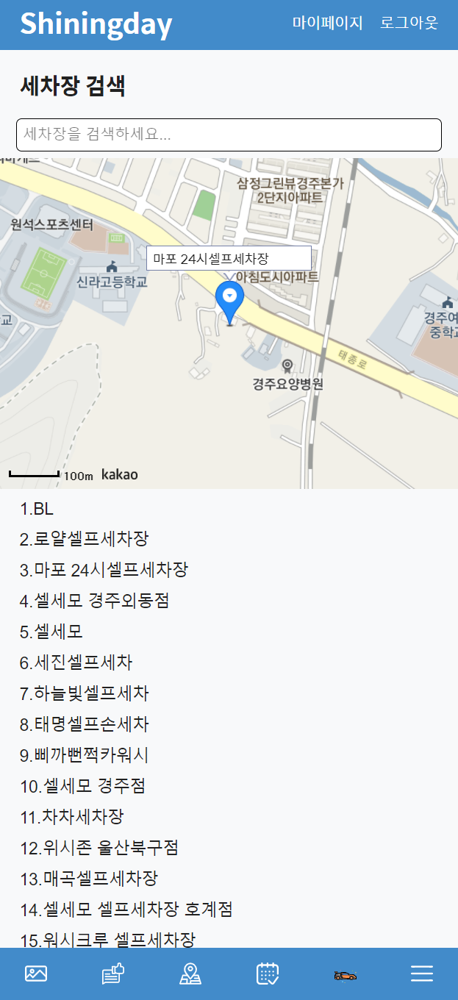

# 세차 커뮤니티 사이트 Shingday:car:

## [🏠 HOME PAGE](https://donggukcarwash.web.app/)

## :blush: 기획의도

세차에 대한 정보를 검색할 때 커뮤니티 사이트(네이버, 다음카페)를 이용한 정보검색을 많이 하지만 다른 주제의 커뮤니티 사이트와 차별성이 없어 세차라는 주제를 파악하기 부족함을 느껴 개발하게 되었습니다.

## 🔥 프로젝트 목표

- HTML5, CSS3, Javascript, React 등 공부했던 내용들을 프로젝트에 사용해보려 했습니다.
- Firebase를 사용해 백엔드의 이해를 높히려고 노력했습니다.
- 개인프로젝트로서 보다 혼자만의 해결방법을 찾으려고 노력했습니다.

## :black_nib: UI 디자인

Figma를 이용하여 프로젝트의 디자인 시안을 제작했습니다.

## :memo: 기술 스택

- FrontEnd : HTML5, CSS3, Javascript, React, Redux, StyledComponent
- BackEnd : Firebase
- etc : Git, Github, Figma

## :blue_book: 프로젝트 주요 기능

### 메인페이지 (세차인증)

### 로그인

### 마이페이지

### 세차장 검색

